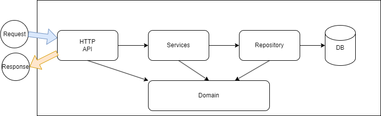
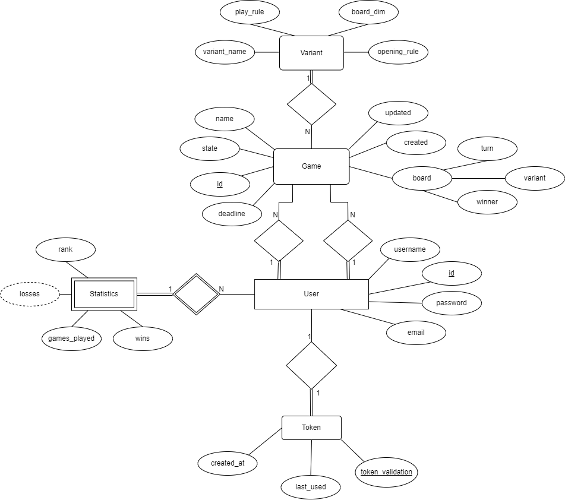

# Technical Document
## - Backend internal software organization:

**The JVM application is organized as follows:**

+ [/domain]() - contains the domain classes of the application, implemented using Spring Data JPA;
+ [/http]() - contains the HTTP layer of the application, implemented using Spring Web MVC;
+ [/repository]() - contains the repository layer of the application, implemented using Spring Data JPA;
+ [/service]() - contains the services that manage the business logic of the application;
+ [/utils]() - contains utility classes used by the application;

## - Data model:

## - Difficulties encountered:

+ Divide de logic of the application in layers;
+ Creating the data model;
+ Implementing the game logic. Most specifically, the functionality of the game with the creation of the variants;
+ Creating the http layer of the application(http routes);
+ Creating the tests for the application. Because of all the cases that the game can have;
+ Linking all backend components;